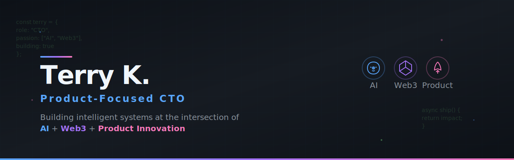

<!-- 
  [필수] 헤더 배너: Canva(https://www.canva.com/) 같은 툴로 1280x400px 사이즈의 배너를 만드세요.
  "Terry K.", "CTO | AI & Web3 Architect | Full-Stack Leader" 와 같은 문구를 넣어보세요.
  이 배너 하나가 프로필의 전체적인 퀄리티를 결정합니다.
-->

  

<h1 align="center">Hi, I'm Terry 👋</h1>
<h3 align="center">A product-focused CTO building intelligent, decentralized systems.</h3>

  <em>I specialize in transforming complex business challenges into market-ready products, leveraging a deep expertise across
   <strong>AI, Web3, Full-Stack Development, and Product Strategy.</strong></em>

---

### ⚔️ My Tech Arsenal

  <em>A comprehensive list of technologies and tools I've mastered.</em>

<table width="100%">
  <tr>
    <td width="50%" valign="top">
      <h4>📦 Product & Strategy</h4>
      

        
        
        
        
         
        <code>Product Management</code> <code>Product Owner</code> <code>GA4</code> <code>BigQuery</code> <code>Tableau</code> <code>Hotjar</code> <code>Click-up</code> <code>Sketch</code> <code>Axure</code>
      

    </td>
    <td width="50%" valign="top">
      <h4>🔗 Blockchain & Web3</h4>
      

        
        
        
        
         
        <code>Truffle</code> <code>Infura</code> <code>Alchemy</code> <code>Moralis</code> <code>DeFi</code> <code>Tokenomics</code> <code>EIP-4337(AA)</code> <code>EIP-2535(Diamonds)</code>
      

    </td>
  </tr>
  <tr>
    <td width="50%" valign="top">
      <h4>🤖 AI & Agents</h4>
      

        
        
        
        
         
        <code>Multi-Agent Systems</code> <code>RAG</code> <code>PEFT</code> <code>MidJourney</code> <code>Stable Diffusion (ComfyUI)</code> <code>n8n</code> <code>Flowise</code> <code>Cursor</code>
      

    </td>
    <td width="50%" valign="top">
      <h4>🎮 Gaming & Metaverse</h4>
      

        
        
         
        
        
         
        <code>Photon Engine</code> <code>Game Sparks</code> <code>Blueprint</code>
      

    </td>
  </tr>
  <tr>
    <td width="50%" valign="top">
      <h4>🌐 Frontend & Mobile</h4>
      

        
        
        
        
         
        
        
        
        
      

    </td>
    <td width="50%" valign="top">
      <h4>⚙️ Backend & DevOps</h4>
      

        
        
        
        
        
        
         
        
        
        
        
        
         
        
        
        
        
         
        
        
      

    </td>
  </tr>
</table>

---

### 📈 My GitHub Activity

  
  

  

