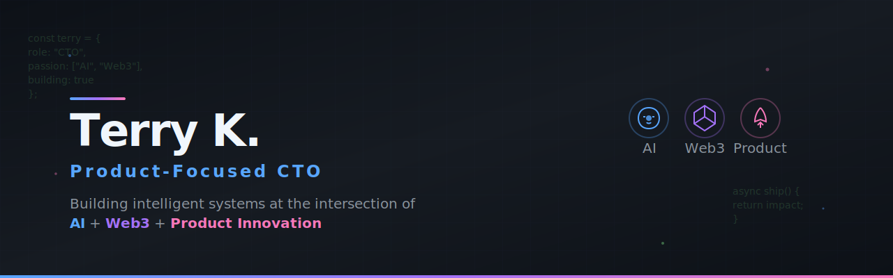

<!-- Header Banner -->


<!-- Typing SVG -->
<p align="center">
  <a href="https://git.io/typing-svg">
    
  </a>
</p>

<!-- Social Badges -->
<p align="center">
  <a href="https://www.linkedin.com/in/terrybear/"></a>
  <a href="https://www.youtube.com/@nocodeCat"></a>
  <a href="https://github.com/fysoul17"></a>
  
</p>

<br/>

<!-- About Section -->


## About Me

A versatile leader who values the **balance between technology and business**. With responsibility and ownership as core values, I aim to deliver substantial value to customers.

```typescript
const terry = {
  title: "Entrepreneur | CTO | Educator",
  experience: "17+ years",
  philosophy: "Customer obsession meets technical excellence",
  currentFocus: ["AI Agent SaaS", "Web3", "Tech Education"],
  languages: ["Korean (Native)", "English (Fluent)", "Japanese (Elementary)"],
  superpower: "Turning complex tech into market-ready products"
};
```

<br clear="right"/>

---

## Career Highlights

<table>
<tr>
<td width="50%">

### Leadership & Scale
- Led teams ranging from **10 to 150+ members**
- Managed infrastructure handling **$750M+ annual transactions**
- Founded & operated **GIX Entertainment** for 6+ years
- CTO roles at **Kakao Krust**, **Altverse**, **Golala**, and more

</td>
<td width="50%">

### Achievements & Recognition
- **Kakao Krust CIC Altverse** Spin-off Investment
- **Golala CTO**: Secured **$4M+ total investment**
- **2014 Unity Games Korea** Winner
- **G-Star Investment Market** Award (Creativity 2nd)
- **UTS:INSEARCH Alumni Prize** Winner

</td>
</tr>
</table>

---

## Education & Content Creation

<p align="center">
  <a href="https://www.youtube.com/@nocodeCat">
    
  </a>
  
</p>

| Platform | Topics |
|----------|--------|
| **YouTube (노코드캣)** | AI Agents, No-Code/Low-Code, Automation |
| **Fast Campus** | n8n, AI Agents, RAG |
| **ClassU** | Vibe Coding |
| **Universities** | Guest lectures at K University, D University, KATS |

---

## Tech Arsenal

<details open>
<summary><b>AI & Automation</b></summary>
<br/>
<p align="center">


</p>
<p align="center">
<code>RAG</code> <code>PEFT</code> <code>AI Agents</code> <code>LangChain</code> <code>Flowise</code> <code>ComfyUI</code> <code>Stable Diffusion</code> <code>MidJourney</code>
</p>
</details>

<details open>
<summary><b>Blockchain & Web3</b></summary>
<br/>
<p align="center">


</p>
<p align="center">
<code>ERC-20/721/1155/404</code> <code>EIP-4337 (AA)</code> <code>EIP-2535 (Diamonds)</code> <code>EIP-4626 (Vaults)</code>
</p>
<p align="center">
<code>DeFi</code> <code>Flashloans</code> <code>LP Vaults</code> <code>Tokenomics</code> <code>Alchemy</code> <code>Infura</code> <code>Moralis</code> <code>The Graph</code>
</p>
</details>

<details open>
<summary><b>Frontend & Mobile</b></summary>
<br/>
<p align="center">


</p>
<p align="center">


</p>
<p align="center">
<code>Redux</code> <code>Recoil</code> <code>XState</code> <code>React Query</code> <code>GraphQL</code> <code>Bloc</code> <code>GetX</code> <code>Riverpod</code>
</p>
</details>

<details open>
<summary><b>Backend & Infrastructure</b></summary>
<br/>
<p align="center">


</p>
<p align="center">


</p>
<p align="center">
<code>Prisma</code> <code>Drizzle</code> <code>Kafka</code> <code>RabbitMQ</code> <code>DynamoDB</code> <code>Airtable</code>
</p>
</details>

<details open>
<summary><b>Cloud & DevOps</b></summary>
<br/>
<p align="center">


</p>
<p align="center">


</p>
</details>

<details>
<summary><b>Gaming & Metaverse</b></summary>
<br/>
<p align="center">


</p>
<p align="center">
<code>Photon Engine</code> <code>Unity Park Suite</code> <code>Game Sparks</code> <code>Blueprint</code>
</p>
</details>

<details>
<summary><b>Product & Analytics</b></summary>
<br/>
<p align="center">


</p>
<p align="center">
<code>GA4</code> <code>BigQuery</code> <code>Tableau</code> <code>Grafana</code> <code>Hotjar</code> <code>Axure</code>
</p>
</details>

<details>
<summary><b>No-Code & Automation</b></summary>
<br/>
<p align="center">


</p>
<p align="center">
<code>Flowise</code> <code>BuildShip</code> <code>Framer</code> <code>Toddle</code> <code>FlutterFlow</code>
</p>
</details>

---

## Open Source Contributions

| Project | Description |
|---------|-------------|
| [**brincx-vault-v1**](https://github.com/brinc-finance/brincx-vault-v1) | DeFi LP Vault Smart Contracts |
| [**google_maps_place_picker**](https://github.com/fysoul17/google_maps_place_picker) | Flutter Google Maps Place Picker |
| [**firebase_auth_simplify**](https://github.com/fysoul17/firebase_auth_simplify) | Simplified Firebase Auth for Flutter |
| [**kakao_flutter_sdk**](https://github.com/fysoul17/kakao_flutter_sdk) | Kakao SDK for Flutter |
| [**flutter_firebase_chat_messenger**](https://github.com/fysoul17/flutter_firebase_chat_messenger) | Firebase Chat for Flutter |
| [**flutter_speed_dial_material_design**](https://github.com/fysoul17/flutter_speed_dial_material_design) | Material Design Speed Dial |
| [**QuasarUnityTools**](https://github.com/fysoul17/QuasarUnityTools) | Unity Development Tools |
| [**discord-bot-boilerplate**](https://github.com/fysoul17/discord-bot-boilerplate) | Discord Bot Starter Template |

---

## GitHub Analytics

<p align="center">
  
  
</p>

<p align="center">
  
</p>

<p align="center">
  
</p>

<!-- Activity Graph -->
<p align="center">
  
</p>

---

## Let's Build Something Amazing

<p align="center">
  <i>I'm always excited to collaborate on innovative projects at the intersection of AI, Web3, and Product.</i>
</p>

<p align="center">
  <a href="https://www.linkedin.com/in/terrybear/">
    
  </a>
  <a href="https://www.youtube.com/@nocodeCat">
    
  </a>
</p>

<br/>

<p align="center">
  
</p>
