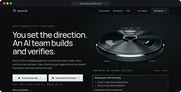
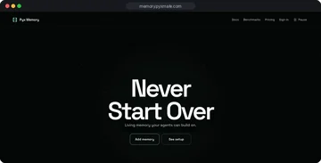
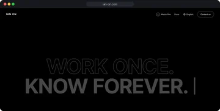
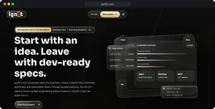
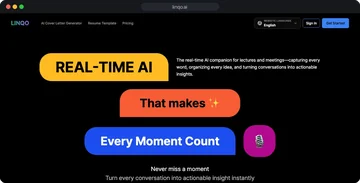
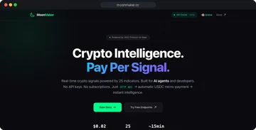
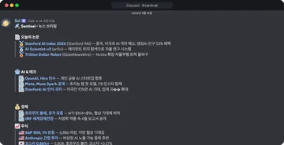
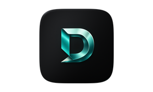
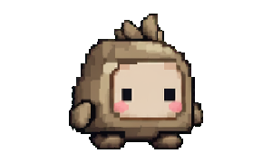

<picture>
  <source media="(prefers-color-scheme: dark)" srcset="./assets/hero-dark.svg">
  
</picture>

  

  <code>Founder</code> · <code>CTO</code> · <code>Product Owner</code> · <code>AI Agents</code> · <code>Harness &amp; Loop Engineering</code> · <code>AX (AI Transformation)</code>

  

---

### 🚀 Products I Ship — built primarily solo with AI agents

**Agent infrastructure**

| | Product | Description |
|:---:|---|---|
|  | ✅&nbsp;[**Devlyn&nbsp;OS**](https://devlyn.pyxmate.com) devlyn.pyxmate.com | Main agent you hand outcomes to — plans, delegates to Claude Code · Codex · Grok, monitors and reports *(main agent in development)* |
|  | ✅&nbsp;[**Pyx&nbsp;Memory**](https://memory.pyxmate.com) memory.pyxmate.com | Memory as a Service for AI agents — decisions, corrections and context that persist across sessions and tools |

**AI for companies & founders**

| | Product | Description |
|:---:|---|---|
|  | ✅&nbsp;[**Ian&nbsp;On**](https://ian-on.com/en) ian&#8209;on.com | AX (AI transformation) platform — an agent for every employee, with approvals and audit trails; the knowledge stays with the company · *led at AIU* |
|  | ✅&nbsp;[**ign8t**](https://www.ign8t.com/en) ign8t.com | Idea → dev-ready specs for coding agents, over MCP · AI supplier for Korea's 모두의창업 (cohorts 1 & 2) |
|  | ✅&nbsp;[**Linqo**](https://www.linqo.ai/) linqo.ai | Real-time AI for lectures & meetings — live transcription, translation, grounded Q&A · *led at AIU* |

**Agent economy** · with Sol

| | Product | Description |
|:---:|---|---|
|  | ✅&nbsp;[**MoonMaker&nbsp;API**](https://moonmaker.cc) moonmaker.cc | Crypto intelligence API that AI agents pay for per call — x402, USDC on Base, no API keys |
|  | ✅&nbsp;[**MoonMaker&nbsp;Arena**](https://moonmaker.cc/arena) moonmaker.cc/arena | Real-time AI agent trading debate + on-chain betting arena |
|  | ✅&nbsp;**Sentinel** Discord · Telegram | AI news digest — auto-delivered to Discord & Telegram through the day |
| | ✅&nbsp;**Trump&nbsp;Monitor** | Real-time Trump post detection → market impact scoring → alerts |
| | ✅&nbsp;[**PayGate**](https://github.com/Sol-agent/paygate) | ETH → USDC on-ramp contract for AI agents — one-click swap on Base |
| | 🔨&nbsp;**Mirror&nbsp;of&nbsp;Destiny** | AI tarot & fortune-telling Telegram mini-app |
| | 🔨&nbsp;**MEB** | Minecraft English Buddy — learn English by playing with AI in Minecraft |

---

### 🤖 My AI team — each built on a different stack

<table width="100%">
  <tr>
    <td align="center" valign="top" width="25%">
       
      <b>Devlyn</b> 
       
      Main agent — hand it an outcome; it plans, delegates and verifies
    </td>
    <td align="center" valign="top" width="25%">
       
      <b>Argon</b> 
       
      Chief of staff — takes every small chore off my plate
    </td>
    <td align="center" valign="top" width="25%">
       
      <b>Trador · Travelor · Scanor</b> 
       
      Bots that help with everything else
    </td>
    <td align="center" valign="top" width="25%">
       
      <b>Sol</b> 
       
      Digital familiar ☀️ behind <a href="https://moonmaker.cc">MoonMaker</a>
    </td>
  </tr>
</table>

  ENGINEERING CREW 
  
  
  
   They build and cross-check each other's work — every significant change gets an adversarial review from another model.

---

### 📦 Open Source I Maintain

| Repository | Description | |
|---|---|---|
| [**devlyn-cli**](https://github.com/fysoul17/devlyn-cli) | Harness that takes coding agents from intent to verified changes — 100+ npm releases | [npm ↗](https://www.npmjs.com/package/devlyn-cli) |
| [**PYX Scanner**](https://scanner.pyxmate.com) | Security scanner for AI-agent skills — [app](https://github.com/Pyx-Corp/pyx-scanner-v1) · [Claude Code skill](https://github.com/Pyx-Corp/pyx-scan) | [site ↗](https://scanner.pyxmate.com) |
| [**devlyn-os-extensions**](https://github.com/fysoul17/devlyn-os-extensions-v1) | Developer kit and extension registry for Devlyn OS | |
| [**google_maps_place_picker**](https://github.com/fysoul17/google_maps_place_picker) | Place picker on Google Maps for Flutter | ⭐&nbsp;229 |
| [**flutter_speed_dial_material_design**](https://github.com/fysoul17/flutter_speed_dial_material_design) | Material Design Speed Dial for Flutter | ⭐&nbsp;31 |
| [**firebase_auth_simplify**](https://github.com/fysoul17/firebase_auth_simplify) | Firebase Auth wrapper — sign-in/out in one line | ⭐&nbsp;17 |
| [**brincx-vault**](https://github.com/brinc-finance/brincx-vault-v1) | Tokenized DeFi vault contracts | |
| [**discord-bot-boilerplate**](https://github.com/fysoul17/discord-bot-boilerplate) | Discord bot boilerplate with Node.js | |
| [**QuasarUnityTools**](https://github.com/fysoul17/QuasarUnityTools) | Useful tools for Unity | |

### 🤝 Open Source I Contribute To

| Project | Contribution | |
|---|---|---|
| [**Lance**](https://github.com/lance-format/lance) | [Reported a durability bug](https://github.com/lance-format/lance/issues/9608) — local writes without fsync leave zero-length manifests | ⭐&nbsp;7k+ |
| [**kordoc**](https://github.com/chrisryugj/kordoc) | [Merged fix](https://github.com/chrisryugj/kordoc/pull/124) — bullet markers no longer pair with inline emphasis | ⭐&nbsp;2k+ |
| [**Altverse contracts**](https://github.com/altverse/altverse-smart-contracts) | [15 merged PRs](https://github.com/altverse/altverse-smart-contracts/pulls?q=is%3Apr+author%3Afysoul17+is%3Amerged) — escrow, gaming-space and campaign contracts | |

> [!NOTE]
> **Open research, failures included.** [200+ public research records](https://github.com/fysoul17/devlyn-cli/tree/main/autoresearch/iterations) on my own agent harness. One verdict: **32/32 target-hit rounds — still NOT PASS**, because 5 of 64 rounds were blocked. [Read it →](https://github.com/fysoul17/devlyn-cli/blob/52f6cc4aa4f541bcbcecf73710cf76bdc5f0c731/autoresearch/experiments/0226/RESULT.md)

---

### ⚔️ Arsenal — 24 years, every layer

   
   
  

  
  
  
  
  
  
  
   
  
  
  
  

---

### 📈 Every day

  <picture>
    <source media="(prefers-color-scheme: dark)" srcset="https://streak-stats.demolab.com?user=fysoul17&theme=dark&hide_border=true&background=00000000">
    
  </picture>

  <picture>
    <source media="(prefers-color-scheme: dark)" srcset="https://raw.githubusercontent.com/fysoul17/fysoul17/output/github-snake-dark.svg">
    <source media="(prefers-color-scheme: light)" srcset="https://raw.githubusercontent.com/fysoul17/fysoul17/output/github-snake.svg">
    
  </picture>

